# Foody

Foody is a versatile application designed to simplify your meal and exercise management. Whether you want to organize your favorite dishes based on diet, explore recipes using specific ingredients, or plan your workouts with personalized nutrient ratios, Foody has got you covered. [Explore Foody](https://foody-24sx.onrender.com).

<br>\
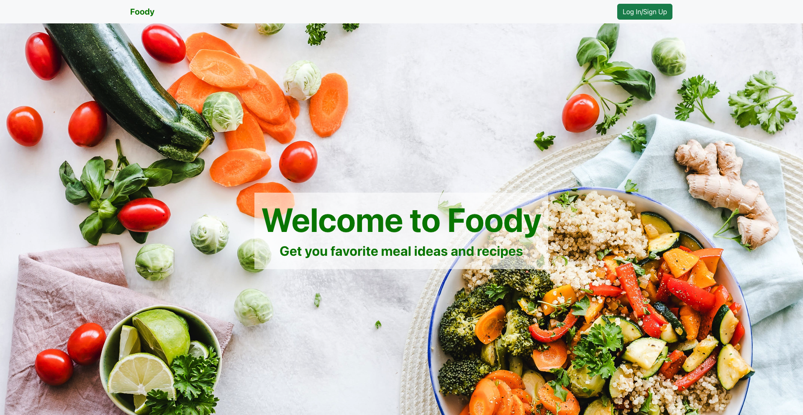
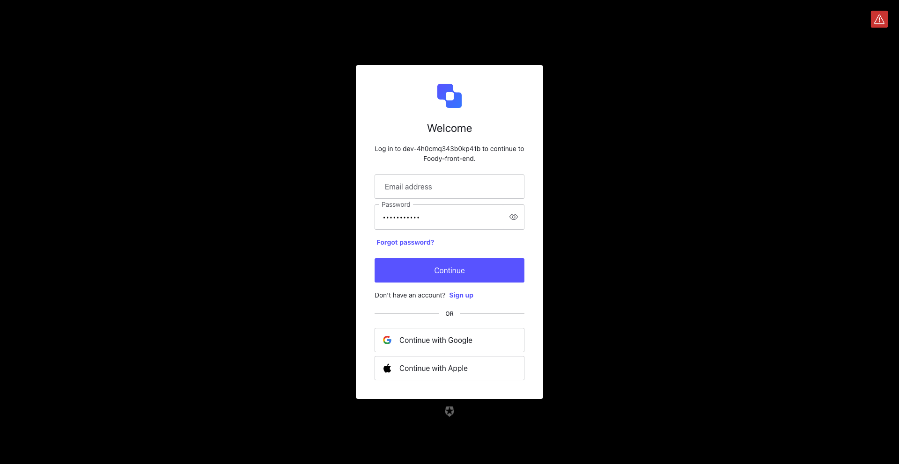
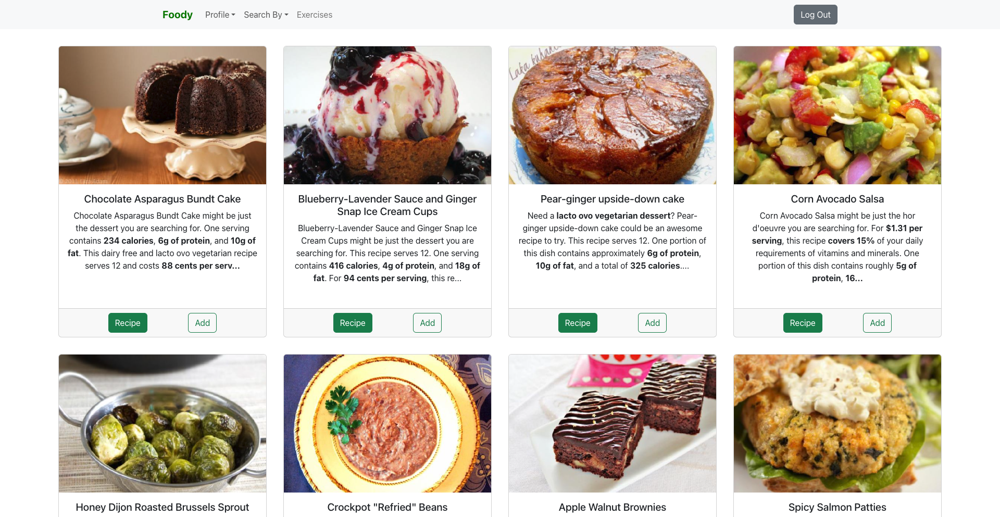
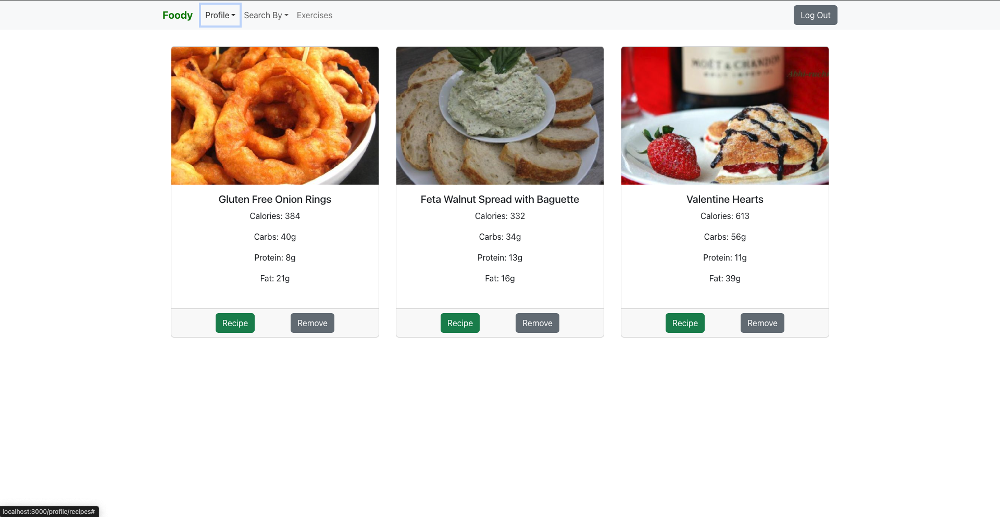
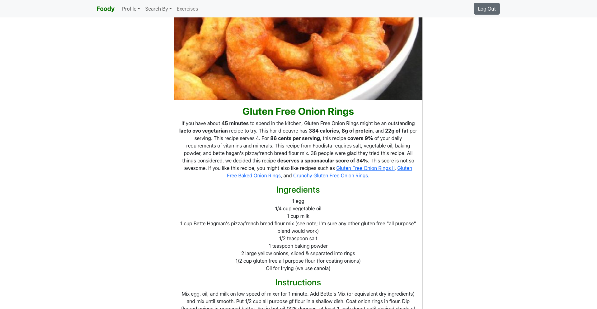
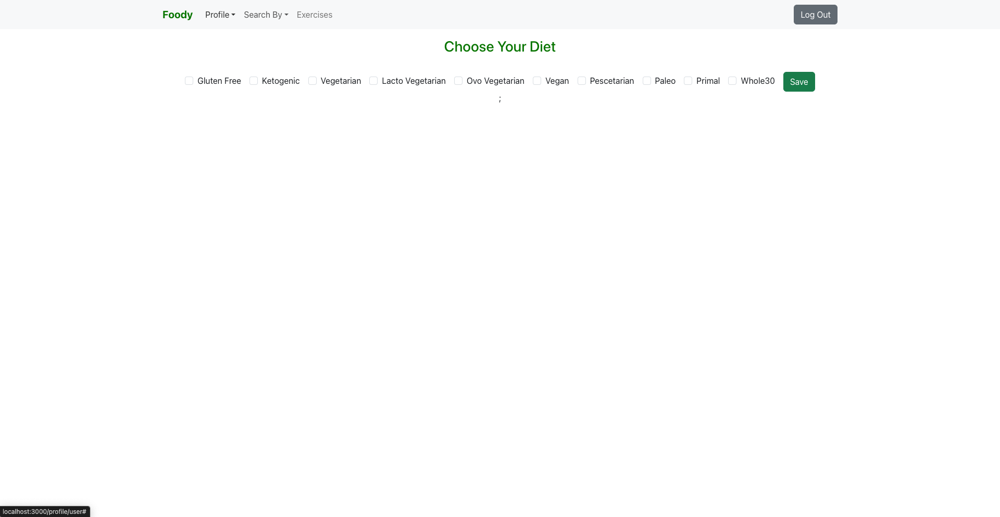
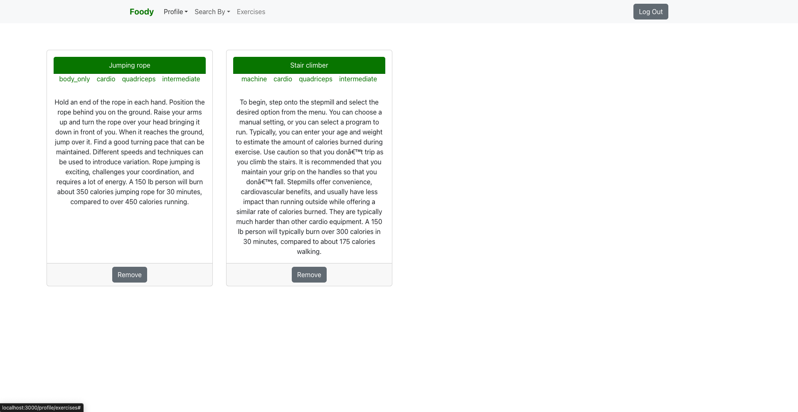
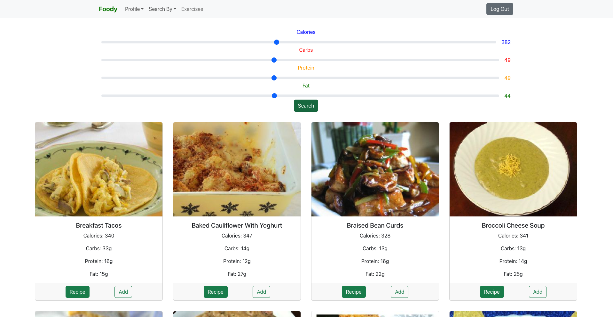

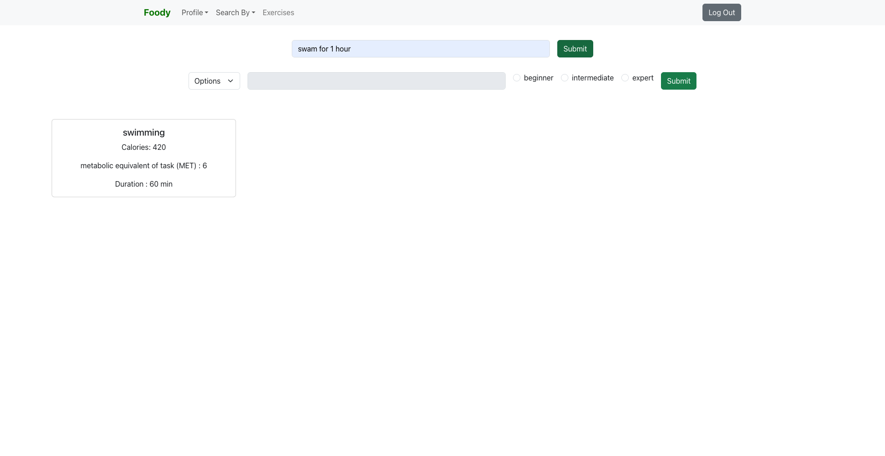
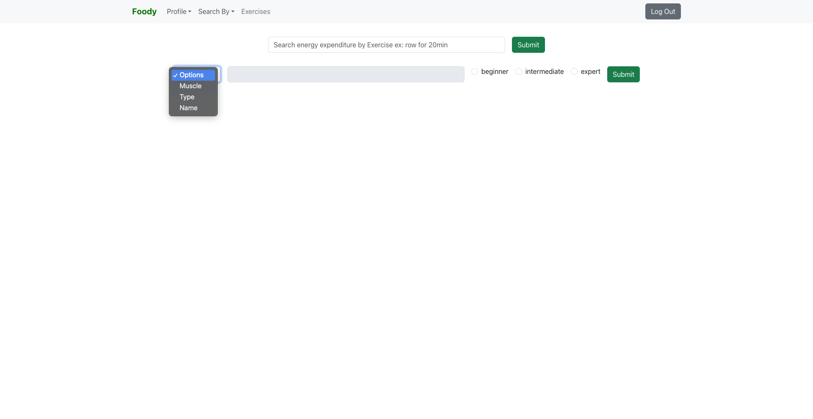
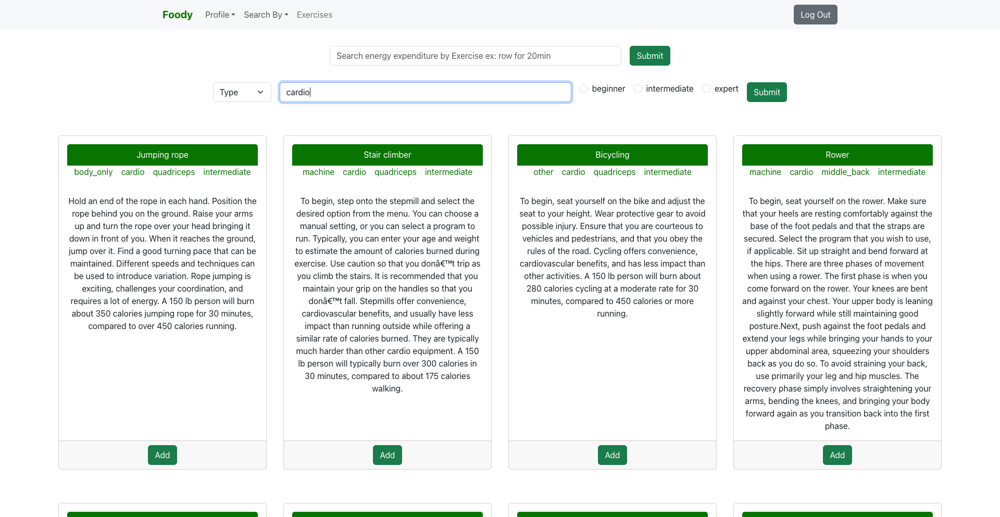


## Table of Contents

- [Features](#features)
- [Getting Started](#getting-started)
  - [Prerequisites](#prerequisites)
  - [Installation](#installation)
- [Usage](#usage)
- [Contributing](#contributing)
- [Support](#support)
- [License](#license)


## Features

### Save Your Favorite Dishes

- Categorize your favorite dishes based on different diets.

### Recipe Discovery

- Discover new recipes by typing ingredients you have on hand.

### Nutrient Ratio Planning

- Plan your meals based on specific nutrient ratios such as carbs, calories, protein, and fat.

### Exercise Planning

- Choose exercises based on the muscle group you want to work on.
- Specify exercise types like cardio or strength training.
- Customize the difficulty level from beginner to expert.

## API used
- **spoonacular API:** for food nutrients https://spoonacular.com/food-api
- **API Ninja:** exercises tip and instruction https://api-ninjas.com/api/exercises
- **Nutritionix:** for exercies expenditure https://developer.syndigo.com/docs/natural-language-for-exercise

## Tech Stack

### Backend

- **Express:** Web framework for Node.js.
- **PostgreSQL:** Relational database for storing user data.

### Frontend

- **React:** Frontend JavaScript library for building user interfaces.

## Getting Started

To run Foody locally, follow these steps:

1. **Clone the repository:**
    ```bash
    git clone https://github.com/your-username/foody.git
    cd foody
    ```

2. **Install Dependencies:**
   - Backend:
     ```bash
     cd foody-backend
     npm install
     ```

   - Frontend:
     ```bash
     cd ../foody-frontend
     npm install
     ```

3. **Set up PostgreSQL Database:**
   - Create a new database called foody and configure the connection in the backend.

4. **Start the Servers:**
   - Backend:
     ```bash
     cd foody-backend
     npm start
     ```

   - Frontend:
     ```bash
     cd ../foody-frontend
     npm start
     ```

5. **Environment Variables:**
   - Create a `.env` file in the `foody-backend` directory.
   - Add the following variables to the `.env` file:

     ```dotenv
     SECRET_KEY=""
     PORT=3001
     ```

   - Create a `.env` file in the `foody-frontend` directory.
   - Add the following variables to the `.env` file:

     ```dotenv
     REACT_APP_AUTH0_DOMAIN=""
     REACT_APP_AUTH0_CLIENT_ID=""
     REACT_APP_AUTH0_CALLBACK_URL=window.location.origin

     REACT_APP_SPOONCULAR_API_KEY=""
     REACT_APP_NUTRITIONIX_APP_ID=""
     REACT_APP_NUTRITIONIX_APP_KEY=""

     REACT_APP_API_NINJA=""
     ```

   - Save the `.env` files.

6. **Start the Servers:**
   - Backend:
     ```bash
     cd foody-backend
     npm install
     npm start
     ```

   - Frontend:
     ```bash
     cd ../foody-frontend
     npm install
     npm start
     ```

7. **Open Your Browser:**
   - Navigate to `http://localhost:3000` to use Foody.

## Contributing

If you'd like to contribute to Foody.

1. Fork the repository.
2. Create a new branch: `git checkout -b feature/your-feature`.
3. Make your changes and commit: `git commit -m 'Add some feature'`.
4. Push to the branch: `git push origin feature/your-feature`.
5. Submit a pull request.

For major changes, please open an issue first to discuss potential modifications.

## License
MIT License

Copyright (c) 2024

Permission is hereby granted, free of charge, to any person obtaining a copy
of this software and associated documentation files (the "Software"), to deal
in the Software without restriction, including without limitation the rights
to use, copy, modify, merge, publish, distribute, sublicense, and/or sell
copies of the Software, and to permit persons to whom the Software is
furnished to do so, subject to the following conditions:

The above copyright notice and this permission notice shall be included in all
copies or substantial portions of the Software.

THE SOFTWARE IS PROVIDED "AS IS", WITHOUT WARRANTY OF ANY KIND, EXPRESS OR
IMPLIED, INCLUDING BUT NOT LIMITED TO THE WARRANTIES OF MERCHANTABILITY,
FITNESS FOR A PARTICULAR PURPOSE AND NONINFRINGEMENT. IN NO EVENT SHALL THE
AUTHORS OR COPYRIGHT HOLDERS BE LIABLE FOR ANY CLAIM, DAMAGES OR OTHER
LIABILITY, WHETHER IN AN ACTION OF CONTRACT, TORT OR OTHERWISE, ARISING FROM,
OUT OF OR IN CONNECTION WITH THE SOFTWARE OR THE USE OR OTHER DEALINGS IN THE
SOFTWARE.
